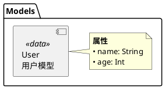
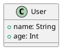
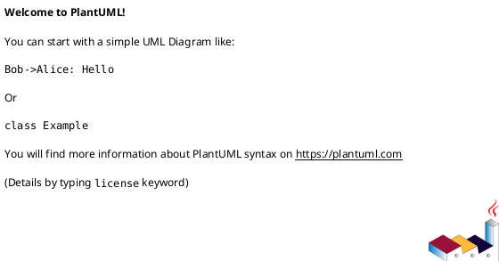
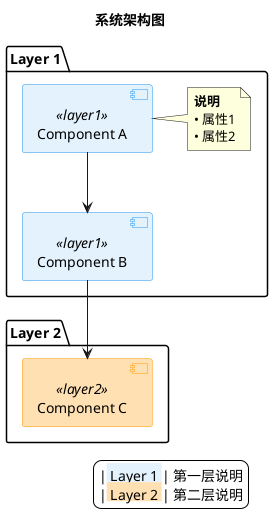

# PlantUML 架构图创建规范

> 本文档记录创建 PlantUML 架构图的最佳实践和常见问题，避免重复踩坑。

---

## 📋 目录

- [环境配置](#环境配置)
- [语法规范](#语法规范)
- [常见错误和解决方案](#常见错误和解决方案)
- [最佳实践](#最佳实践)
- [参考模板](#参考模板)

---

## 🔧 环境配置

### 1. PlantUML 版本问题

**问题**: Cursor/VSCode 可能使用插件内置的旧版本 PlantUML，导致警告：
```
This version of PlantUML is 1746 days old...
```

**解决方案**:

#### Step 1: 安装最新版 PlantUML
```bash
brew install plantuml
brew upgrade plantuml
```

#### Step 2: 查找 JAR 文件路径
```bash
# 查看脚本内容
cat /opt/homebrew/bin/plantuml

# 输出示例：
# exec java -jar /opt/homebrew/Cellar/plantuml/1.2025.9/libexec/plantuml.jar "$@"
```

实际 JAR 路径: `/opt/homebrew/Cellar/plantuml/1.2025.9/libexec/plantuml.jar`

#### Step 3: 配置 Cursor/VSCode

**错误配置** ❌:
```json
{
  "plantuml.jar": "/opt/homebrew/bin/plantuml"  // 这是脚本，不是 JAR！
}
```

**正确配置** ✅:
```json
{
  "plantuml.commandArgs": [],
  "plantuml.jar": "/opt/homebrew/Cellar/plantuml/1.2025.9/libexec/plantuml.jar"
}
```

配置文件位置:
- Cursor: `~/Library/Application Support/Cursor/User/profiles/51ae6f81/settings.json`
- VSCode: `~/Library/Application Support/Code/User/settings.json`

#### Step 4: 重启 IDE
`Cmd + Shift + P` → `Reload Window`

---

## 📝 语法规范

### 1. 基础模板结构


### 2. Component 图语法

#### ✅ 正确写法

**方式 1: 简洁格式（推荐）**
```plantuml
package "包名" {
  [组件名\n描述信息] as 别名 <<标签>>
  
  note right of 别名
    **详细说明**
    • 属性1
    • 属性2
  end note
}
```

**方式 2: 使用 component 关键字**
```plantuml
component "组件名\n描述" as 别名 <<标签>> {
  portin 输入端口
  portout 输出端口
}

note right of 别名
  详细说明
end note
```

#### ❌ 错误写法

**不要在 component 图中混用 class:**
```plantuml
' ❌ 错误！这会导致语法错误
package "Data Models" {
  class GridPos <<data>> {
    + col: Int
    + row: Int
  }
}
```

**不要在组件内部使用 [...] 语法:**
```plantuml
' ❌ 错误！内部方括号会被解析为新组件
component [AppModel] as AppModel {
  [启动入口]  // ❌ 这会导致解析错误
  [AudioKit 配置]
}
```

**正确做法:**
```plantuml
' ✅ 正确！使用 \n 换行
[AppModel\n启动入口\nAudioKit配置] as AppModel <<标签>>

' 或使用 note 补充说明
[AppModel] as AppModel <<标签>>
note right of AppModel
  • 启动入口
  • AudioKit 配置
end note
```

### 3. 关系连接语法

```plantuml
' 组合（包含）
A *-- B
A *-down- B  ' 带方向

' 依赖（强引用）
A --> B
A -down-> B  ' 带方向

' 使用（弱引用）
A ..> B
A .down.> B  ' 带方向

' 实现接口
A ..|> B
A .up.|> B  ' 带方向

' 跨包引用
package "Package1" {
  [ComponentA] as CompA
}

package "Package2" {
  [ComponentB] as CompB
  
  ' ✅ 在定义处建立关系
  CompA --> CompB
}
```

### 4. 中文字体配置

**问题**: 中文显示为乱码或方框

**解决方案**:
```plantuml
skinparam defaultFontName "PingFang SC,Microsoft YaHei,SimHei,Arial Unicode MS"
```

字体优先级:
1. `PingFang SC` - macOS 默认中文字体（推荐）
2. `Microsoft YaHei` - Windows 默认中文字体
3. `SimHei` - 通用黑体
4. `Arial Unicode MS` - 兜底字体

---

## ⚠️ 常见错误和解决方案

### 错误 1: 元素重复定义

**错误信息**:
```
This element (TozModel) is already defined
```

**问题代码**:
```plantuml
package "App Layer" {
  [TozPage] as TozPage
  TozPage --> TozModel  ' ❌ 第一次引用
}

package "Core ViewModel" {
  [TozModel] as TozModel  ' ❌ 第二次定义，冲突！
}
```

**解决方案**:
```plantuml
package "App Layer" {
  [TozPage] as TozPage
  ' ✅ 不在这里建立关系
}

package "Core ViewModel" {
  [TozModel] as TozModel
  
  ' ✅ 在定义后建立关系
  TozPage --> TozModel
}
```

**原则**: 
- 每个元素只定义一次
- 跨包引用在定义元素的包中建立关系

### 错误 2: Invalid or corrupt jarfile

**错误信息**:
```
Error: Invalid or corrupt jarfile /opt/homebrew/bin/plantuml
```

**原因**: 配置指向了脚本包装器，而非实际的 JAR 文件

**解决**: 参见 [环境配置](#环境配置) 第 2-3 步

### 错误 3: 在 Component 图中使用 class

**错误信息**:
```
Syntax Error? (Assumed diagram type: component)
```

**问题代码**:
```plantuml
@startuml
package "Models" {
  class User {  ' ❌ component 图不支持
    + name: String
  }
}
@enduml
```

**解决方案 1: 使用 Component 语法**


**解决方案 2: 改用 Class 图**


### 错误 4: 全角符号导致解析失败

**问题**: 中文输入法导致输入了全角符号

**常见全角符号**:
- `｛` `｝` (全角花括号) ❌
- `（` `）` (全角括号) ❌
- `：` (全角冒号) ❌

**解决**: 始终使用半角符号
- `{` `}` (半角花括号) ✅
- `(` `)` (半角括号) ✅
- `:` (半角冒号) ✅

**检测方法**:
```bash
# 在文件中搜索全角符号
grep -n '｛\|｝\|（\|）\|：' your_file.puml
```

---

## ✨ 最佳实践

### 1. 文件组织

```
project/
├── Flow/
│   ├── architecture.puml      # 总体架构图
│   ├── chord-recognition-flow.puml  # 和弦识别算法流程
│   ├── data-flow.puml         # 数据流图
│   ├── view-hierarchy.puml    # 视图层次图
│   ├── *.svg                  # 生成的图片（gitignore）
│   └── README.md              # 架构文档索引
```

### 2. 命名规范

**文件命名**:
- 使用小写 + 连字符: `data-flow.puml` ✅
- 避免空格和大写: `Data Flow.puml` ❌

**图表 ID**:


**元素别名**:
```plantuml
[TozModel\n核心ViewModel] as TozModel  ' ✅ 简洁清晰
[TozModel\n核心ViewModel] as toz_model_view_model_component  ' ❌ 过长
```

### 3. 颜色规范

**使用一致的配色方案**:
```plantuml
skinparam component {
  ' 应用层 - 蓝色系
  BackgroundColor<<app>> #E3F2FD
  BorderColor<<app>> #2196F3
  
  ' ViewModel - 橙色系
  BackgroundColor<<viewmodel>> #FFE0B2
  BorderColor<<viewmodel>> #FF9800
  
  ' 服务层 - 黄色系
  BackgroundColor<<service>> #FFF9C4
  BorderColor<<service>> #FBC02D
  
  ' UI层 - 粉色系
  BackgroundColor<<ui>> #F8BBD0
  BorderColor<<ui>> #E91E63
  
  ' 数据模型 - 青色系
  BackgroundColor<<data>> #B2DFDB
  BorderColor<<data>> #009688
  
  ' 第三方库 - 灰色系
  BackgroundColor<<external>> #ECEFF1
  BorderColor<<external>> #607D8B
}
```

**颜色选择原则**:
- 使用 Material Design 颜色 (100-500 范围)
- 背景色浅色 (100-200)
- 边框色深色 (400-600)
- 同类组件使用同色系

### 4. 注释规范

```plantuml
' ============================================================
' 1. 模块名称
' ============================================================

package "Package Name" {
  ' 单行注释说明
  [Component] as Comp
  
  note right of Comp
    **Markdown 格式说明**
    • 列表项 1
    • 列表项 2
    
    **代码示例**
    func example() {
      // code
    }
  end note
}
```

### 5. 模块化组织

**大型架构图拆分策略**:

```plantuml
' architecture.puml - 总览
@startuml architecture
!include app-layer.puml
!include viewmodel-layer.puml
!include service-layer.puml
!include ui-layer.puml
@enduml
```

**或使用独立文件**:
- `architecture.puml` - 总体架构（高层次）
- `data-flow.puml` - 数据流详细说明
- `view-hierarchy.puml` - UI 层次详细说明
- `state-management.puml` - 状态管理详细说明

### 6. 图例规范

**始终添加图例说明**:
```plantuml
legend right
  |<back:#E3F2FD> 应用层 </back>| App 入口和状态管理
  |<back:#FFE0B2> ViewModel </back>| 核心业务逻辑
  
  **符号说明**
  | *-- | 组合(包含) |
  | --> | 依赖(强引用) |
  | ..> | 使用(弱引用) |
  
  **架构特点**
  • MVVM 架构模式
  • 单向数据流
  • 响应式状态管理
endlegend
```

---

## 📚 参考模板

### 模板 1: Component 架构图



### 模板 2: Activity 流程图

```plantuml
@startuml activity_flow
skinparam backgroundColor white
skinparam defaultFontName "PingFang SC,Microsoft YaHei,SimHei,Arial Unicode MS"

title 业务流程图

skinparam activity {
  BackgroundColor<<phase1>> #d4edda
  BorderColor<<phase1>> #28a745
  BackgroundColor<<phase2>> #cfe2ff
  BorderColor<<phase2>> #0d6efd
}

start

:步骤 1<<phase1>>;
note right
  详细说明
end note

if (条件判断?) then (是)
  :步骤 2A<<phase2>>;
else (否)
  :步骤 2B<<phase2>>;
endif

:步骤 3<<phase1>>;

stop

legend right
  |<back:#d4edda> Phase 1 </back>| 第一阶段
  |<back:#cfe2ff> Phase 2 </back>| 第二阶段
endlegend

@enduml
```

---

## 🛠️ 实用命令

### 语法检查
```bash
plantuml -syntax your_file.puml
```

### 生成 SVG（推荐）
```bash
plantuml -tsvg your_file.puml
# 示例：生成和弦识别算法流程图
plantuml -tsvg Flow/chord-recognition-flow.puml
```

### 生成 PNG
```bash
plantuml -tpng your_file.puml
```

### 批量生成
```bash
plantuml -tsvg Flow/*.puml
```

### 监视模式（自动重新生成）
```bash
plantuml -tsvg -gui your_file.puml
```

---

## 📖 参考项目

**参考正确的语法示例**:
- `MusicAnalysis/key_analysis/flow_overview.puml` - Component 图示例
- `MusicAnalysis/key_analysis/flow_current.puml` - Activity 图示例

**学习要点**:
1. ✅ 使用 `[组件名]` 而非 `component {...}`
2. ✅ 使用 `note` 添加详细说明
3. ✅ 统一的样式定义
4. ✅ 清晰的图例说明
5. ✅ 合理的模块分组

---

## 🔗 相关资源

- [PlantUML 官方文档](https://plantuml.com/)
- [PlantUML 组件图指南](https://plantuml.com/component-diagram)
- [PlantUML 活动图指南](https://plantuml.com/activity-diagram-beta)
- [Material Design 配色](https://material.io/design/color/)

---

## 📝 更新日志

### 2025-10-22
- 创建初始版本
- 记录环境配置问题和解决方案
- 记录常见语法错误
- 添加最佳实践和模板

---

**作者**: Lingchuan Pan  
**创建日期**: 2025-10-22  
**最后更新**: 2025-10-22

